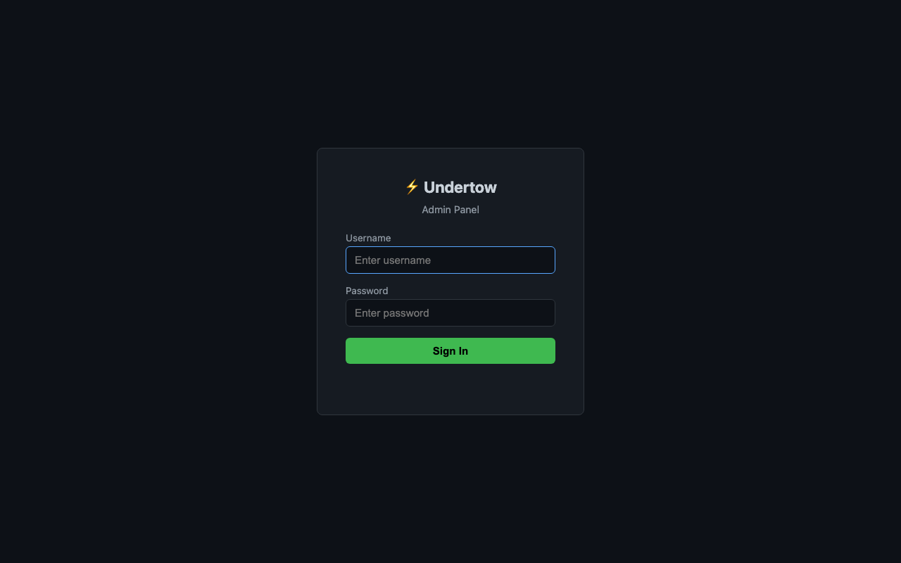
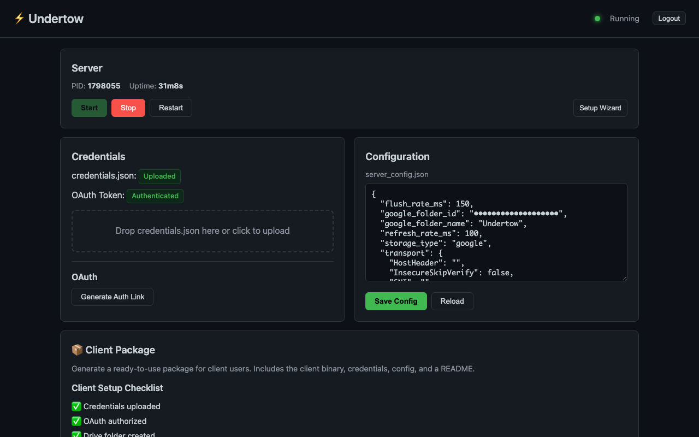
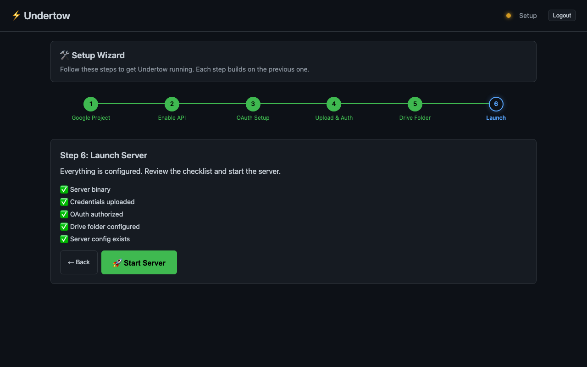
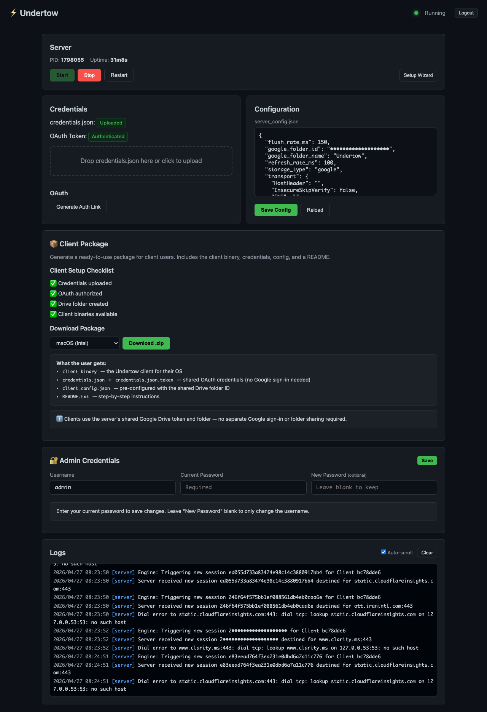

# Undertow 🌊

> Originally inspired by the FlowDriver project — extended with admin panel, setup wizard, client packaging, and system tray app.

**Undertow** is a covert transport system designed to tunnel network traffic (SOCKS5) through common cloud storage platforms like Google Drive. It allows for reliable communication in restrictive environments by leveraging legitimate API traffic.

**Undertow** یک سیستم انتقال پنهان (Covert Transport) است که برای تونل کردن ترافیک شبکه (SOCKS5) از طریق پلتفرم‌های ذخیره‌سازی ابری رایج مانند گوگل درایو طراحی شده است. این ابزار با بهره‌گیری از ترافیک قانونی API، امکان ارتباط مطمئن در محیط‌های محدود شده را فراهم می‌کند.

---

## Screenshots

| Login | Dashboard | Setup Wizard |
|:---:|:---:|:---:|
|  |  |  |

<details>
<summary>Full Dashboard (click to expand)</summary>



</details>

---

## ⚠️ Disclaimer / سلب مسئولیت

**English**: This project is intended for personal usage and research purposes only. Please do not use it for illegal purposes, and do not use it in a production environment. The authors are not responsible for any misuse of this tool.

**فارسی**: این پروژه صرفاً برای استفاده شخصی و اهداف تحقیقاتی در نظر گرفته شده است. لطفاً از آن برای مقاصد غیرقانونی استفاده نکنید و در محیط‌های عملیاتی (Production) از آن استفاده نشود. نویسندگان هیچ مسئولیتی در قبال سوء استفاده از این ابزار ندارند.

---

## How it Works / نحوه عملکرد

### English
Undertow works by treating a cloud storage folder as a data queue:
1.  **Client**: Captures local SOCKS5 requests and bundles them into a compact **Binary Protocol**. These binary "packets" are uploaded to a specific Google Drive folder.
2.  **Server**: Continuously polls the Drive folder. When it finds a request from a client, it downloads it, opens a real TCP connection to the destination, and sends back the result as a response file.

### فارسی
نحوه عملکرد این ابزار به این صورت است که از یک پوشه در فضای ابری به عنوان صف داده‌ها استفاده می‌کند:
1.  **کلاینت**: درخواست‌های SOCKS5 محلی را دریافت کرده و آن‌ها را در قالب یک **پروتکل باینری** فشرده بسته‌بندی می‌کند. این بسته‌ها در یک پوشه خاص در گوگل درایو آپلود می‌شوند.
2.  **سرور**: به طور مداوم پوشه درایو را بررسی می‌کند. با یافتن درخواست جدید، آن را دانلود کرده، اتصال TCP واقعی را برقرار می‌کند و نتیجه را در قالب فایل‌های پاسخ به درایو بازمی‌گرداند.

---

## Quick Start (Admin Panel) / شروع سریع

The **easiest way** to set up Undertow is through the web admin panel. It includes a step-by-step wizard that walks you through everything — no terminal needed after the initial deploy.

ساده‌ترین راه برای راه‌اندازی Undertow استفاده از پنل مدیریت وب است. این پنل شامل یک ویزارد گام‌به‌گام است که شما را در تمام مراحل راهنمایی می‌کند.

### One-Line Install (Linux)

```bash
curl -fsSL https://raw.githubusercontent.com/OvaThinka-Net/Undertow/main/setup.sh | sudo bash
```

Auto-detects architecture, downloads the latest release, installs to `/opt/undertow`, and starts the systemd service. Then open `http://your-server-ip:8090` and follow the wizard.

### Manual Build & Deploy

### 1. Build & Deploy Admin

```bash
# Build admin + server binaries for Linux
CGO_ENABLED=0 GOOS=linux GOARCH=amd64 go build -ldflags="-s -w" -trimpath -o bin/admin ./cmd/admin
CGO_ENABLED=0 GOOS=linux GOARCH=amd64 go build -ldflags="-s -w" -trimpath -o bin/server ./cmd/server

# Copy to your server
scp bin/admin bin/server admin_config.json.example user@server:/path/to/undertow/
```

### 2. Configure Admin

Create `admin_config.json` on the server (see `admin_config.json.example`):

```json
{
  "host": "0.0.0.0",
  "port": 8090,
  "username": "admin",
  "password": "admin",
  "session_hours": 168,
  "server_bin": "server",
  "server_config": "server_config.json",
  "credentials_file": "credentials.json"
}
```

### 3. Run & Open

```bash
./admin
```

Open `http://your-server-ip:8090` in your browser. The wizard will guide you through:
1. Creating a Google Cloud project
2. Enabling the Google Drive API
3. Setting up OAuth consent screen
4. Creating & uploading credentials
5. Creating the Drive folder & authenticating
6. Starting the tunnel server

### 4. Download Client Packages

Once the server is running, the admin dashboard lets you download ready-to-use **client `.zip` files** for all platforms. Each package includes the binary, config, shared OAuth token, folder ID, and a README — clients just extract and run, no Google sign-in needed.

### Systemd Service (Optional)

```ini
[Unit]
Description=Undertow Admin
After=network.target

[Service]
Type=simple
WorkingDirectory=/path/to/undertow
ExecStart=/path/to/undertow/admin
Restart=always

[Install]
WantedBy=multi-user.target
```

### Admin Features
- **Setup Wizard**: 6-step guided walkthrough
- **Process Manager**: Start/stop the tunnel server from the browser
- **Live Logs**: Real-time server log streaming
- **Admin Credentials**: Change username/password from the dashboard (saved to config file)
- **Client Packages**: Download client zips for macOS, Linux, and Windows (arm64 & amd64) — includes shared OAuth token and folder ID (no Google sign-in needed on clients)
- **Cookie-based Auth**: Password-protected with configurable session duration
- **Forced Password Change**: First login with default credentials requires immediate password change

### Security
- **SSRF Protection**: The server blocks all connections to private/reserved IP ranges (RFC 1918, loopback, link-local). Attempts to reach LAN targets through the tunnel are rejected and redirected to a teapot.
- **CSRF Protection**: POST API calls require `X-Requested-With` header
- **Security Headers**: `X-Frame-Options`, `X-Content-Type-Options`, CSP
- **Atomic Config Writes**: Config files are written to `.tmp` then renamed to prevent corruption
- **Token Expiry Validation**: Session tokens are validated for maximum age

---

## Manual Setup (CLI) / راه‌اندازی دستی

If you prefer to set things up manually without the admin panel:

### Prerequisites / پیش‌نیازها
- **Go** (1.25 or higher)
- **Google Drive API Credentials**: You need a `credentials.json` (OAuth2) file.
- **Shared Folder (Auto)**: If you leave `google_folder_id` empty, the tool will automatically create a folder and save its ID to your config.

### 1. Obtain Credentials / دریافت فایل اعتبارنامه

**English:**
1.  **Enable the API**: Go to the [Google Cloud Console](https://console.cloud.google.com/), create a project, and enable the **Google Drive API**.
2.  **Configure Consent Screen**: Go to "APIs & Services" > "OAuth consent screen." Fill in the app name and user support email (Branding).
3.  **Create Credentials**: Go to "Credentials" > "Create Credentials" > **OAuth client ID**. Select **Desktop App** as the application type.
4.  **Download JSON**: Download the client secret file and rename it to `credentials.json`.
5.  **Publish App (Optional but Recommended)**: If your app status is "Testing," your token will expire every 7 days. Go to the OAuth consent screen and click "Publish App" to make the authorization permanent for your account.

**فارسی:**
1.  **فعال‌سازی API**: به [کنسول گوگل کلاود](https://console.cloud.google.com/) بروید، یک پروژه بسازید و **Google Drive API** را فعال کنید.
2.  **تنظیم صفحه رضایت**: به بخش "APIs & Services" > "OAuth consent screen" بروید. نام برنامه و ایمیل پشتیبانی را وارد کنید (بخش Branding).
3.  **ساخت اعتبارنامه**: به بخش "Credentials" > "Create Credentials" > **OAuth client ID** بروید. نوع برنامه را **Desktop App** انتخاب کنید.
4.  **دانلود فایل**: فایل کلاینت سکرت را دانلود کرده و نام آن را به `credentials.json` تغییر دهید.
5.  **انتشار برنامه (پیشنهادی)**: اگر وضعیت برنامه روی "Testing" باشد، توکن شما هر ۷ روز منقضی می‌شود. در صفحه OAuth consent screen بر روی "Publish App" کلیک کنید تا دسترسی برای اکانت شما دائمی شود.

### 2. Build / ساخت فایل‌های اجرایی

```bash
go build -o bin/client ./cmd/client
go build -o bin/server ./cmd/server
```

### 3. Configuration / پیکربندی

**Client Side (`client_config.json`):**
```json
{
  "listen_addr": "127.0.0.1:1080",
  "storage_type": "google",
  "google_folder_id": "YOUR_FOLDER_ID",
  "refresh_rate_ms": 100,
  "flush_rate_ms": 300,
  "transport": {
    "TargetIP": "216.239.38.120:443",
    "SNI": "google.com",
    "HostHeader": "www.googleapis.com"
  }
}
```

**Server Side (`server_config.json`):**
```json
{
  "storage_type": "google",
  "google_folder_id": "YOUR_FOLDER_ID",
  "refresh_rate_ms": 100,
  "flush_rate_ms": 300
}
```

### 4. Run / اجرا

**Server:**
```bash
./bin/server -c server_config.json -gc credentials.json
```

**Client:**
```bash
./bin/client -c client_config.json -gc credentials.json
```

### 5. First-Time Authentication / احراز هویت اولیه

The project uses OAuth2 "3-legged" flow. You only need to do this once:

**English:**
1.  Run the client or server. A link will appear in your terminal.
2.  **Copy and open it** in your web browser.
3.  Log in to your Google account and grant permissions.
4.  You will be redirected to an address starting with `http://localhost` (it's okay if the page doesn't load).
5.  **Copy the entire URL** from your browser's address bar and paste it back into your terminal.
6.  The program will create a `.token` file next to your `credentials.json`. Authorization is now complete.

**فارسی:**
1. کلاینت یا سرور را اجرا کنید. یک لینک در ترمینال ظاهر می‌شود.
2. آن را کپی کرده و در مرورگر خود باز کنید.
3. وارد اکانت گوگل خود شوید و دسترسی‌های لازم را تایید کنید.
4. شما به آدرسی که با `http://localhost` شروع می‌شود هدایت می‌شوید (اشکالی ندارد اگر صفحه باز نشود).
5. **کل آدرس URL** را از نوار آدرس مرورگر کپی کرده و در ترمینال پیست کنید.
6. برنامه یک فایل `.token` در کنار `credentials.json` شما می‌سازد. احراز هویت تمام شد.

### 6. Deploying to Server / استقرار در سرور

Once you have the `.token` file, you don't need to log in again.

**English:**
1.  Copy `credentials.json` **AND** the `.token` file to the server.
2.  **Crucial**: Both client and server must use the **SAME** `credentials.json` (same OAuth client ID) and the **SAME** `google_folder_id`.
3.  Run: `./bin/server -c server_config.json -gc credentials.json`

**فارسی:**
1. فایل `credentials.json` **و** فایل `.token` را به سرور منتقل کنید.
2. **خیلی مهم**: کلاینت و سرور باید از **همان** `credentials.json` (همان OAuth client ID) و **همان** `google_folder_id` استفاده کنند.
3. اجرا کنید: `./bin/server -c server_config.json -gc credentials.json`

---

## System Tray App (macOS) / اپلیکیشن سیستم تری

A native macOS menu bar app for clients. Connect/disconnect the tunnel with one click — no terminal required.

```bash
# Build (requires CGO for macOS Cocoa)
go build -o bin/tray ./cmd/tray
```

Place `client_config.json` and `credentials.json` in `~/.undertow/`, then run `./bin/tray`. The menu bar icon shows connection status and lets you toggle the tunnel.

---

## Performance & Quotas / عملکرد و سهمیه‌ها

**Important**: Google Drive has strict API rate limits (quotas).
- Using very low values (e.g., `refresh_rate_ms: 100`) will consume your API quota very quickly.
- To avoid connections being limited or blocked, keep these values above **100ms** at all times.
- For heavy usage or multiple concurrent users, set these to **200ms or higher**.

**نکته مهم**: گوگل درایو محدودیت‌های سفت‌وسختی برای تعداد درخواست‌های API (Quota) دارد.
- استفاده از مقادیر بسیار پایین (مثلاً `100ms`) باعث می‌شود سهمیه API شما به سرعت تمام شود.
- برای جلوگیری از محدود شدن یا قطع شدن اتصال، توصیه می‌شود این مقادیر همیشه بالای **100ms** باشند.
- برای استفاده‌های سنگین بهتر است این مقادیر را روی **200ms یا بالاتر** تنظیم کنید.

---

## Building All Platforms / ساخت برای تمام پلتفرم‌ها

```bash
# Server & Admin (Linux x86_64)
CGO_ENABLED=0 GOOS=linux GOARCH=amd64 go build -ldflags="-s -w" -trimpath -o bin/server-linux-amd64 ./cmd/server
CGO_ENABLED=0 GOOS=linux GOARCH=amd64 go build -ldflags="-s -w" -trimpath -o bin/admin-linux-amd64 ./cmd/admin

# Client (all platforms)
CGO_ENABLED=0 GOOS=darwin  GOARCH=arm64 go build -ldflags="-s -w" -trimpath -o bin/client-darwin-arm64 ./cmd/client
CGO_ENABLED=0 GOOS=darwin  GOARCH=amd64 go build -ldflags="-s -w" -trimpath -o bin/client-darwin-amd64 ./cmd/client
CGO_ENABLED=0 GOOS=linux   GOARCH=amd64 go build -ldflags="-s -w" -trimpath -o bin/client-linux-amd64 ./cmd/client
CGO_ENABLED=0 GOOS=linux   GOARCH=arm64 go build -ldflags="-s -w" -trimpath -o bin/client-linux-arm64 ./cmd/client
CGO_ENABLED=0 GOOS=windows GOARCH=amd64 go build -ldflags="-s -w" -trimpath -o bin/client-windows-amd64.exe ./cmd/client
CGO_ENABLED=0 GOOS=windows GOARCH=arm64 go build -ldflags="-s -w" -trimpath -o bin/client-windows-arm64.exe ./cmd/client

# Tray (macOS only, requires CGO)
GOOS=darwin GOARCH=arm64 go build -ldflags="-s -w" -trimpath -o bin/tray-darwin-arm64 ./cmd/tray
GOOS=darwin GOARCH=amd64 go build -ldflags="-s -w" -trimpath -o bin/tray-darwin-amd64 ./cmd/tray
```
